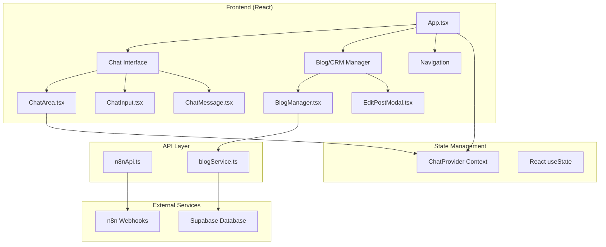

# 🏗️ Teknisk Arkitektur

> **Detaljert teknisk dokumentasjon for AI Agent Frontend Template**

## 📊 System Oversikt



---

## 🔧 Teknisk Stack

### Frontend
- **React 18.2.0** - UI library med moderne hooks
- **TypeScript** - Type safety og bedre DX
- **Tailwind CSS** - Utility-first styling
- **Vite** - Build tool og dev server
- **Lucide React** - Icon library

### State Management
- **React Context API** - Global state management
- **useState/useEffect** - Local component state
- **Custom hooks** - Reusable state logic

### External Services
- **n8n** - AI workflow orchestration
- **Supabase** - Database og real-time features
- **Axios** - HTTP client for API calls

---

## 📁 Detaljert Filstruktur

```
src/
├── components/                    # React komponenter
│   ├── Blog/                     # Blog/CRM relaterte komponenter
│   │   ├── BlogManager.tsx       # Hovedtabell for blog posts
│   │   ├── EditPostModal.tsx     # Modal for redigering
│   │   └── SimpleBlogManager.tsx # Fallback uten Supabase
│   ├── Chat/                     # Chat relaterte komponenter  
│   │   └── EnhancedChatArea.tsx  # Chat med CRM integrasjon
│   ├── ChatArea.tsx              # Standard chat område
│   ├── ChatInput.tsx             # Input felt med send funksjonalitet
│   ├── ChatMessage.tsx           # Individuell melding rendering
│   ├── ConnectionStatus.tsx      # n8n tilkobling status
│   └── Sidebar.tsx               # Agent selector sidebar
├── store/                        # State management
│   └── chatStore.ts              # Chat context provider
├── types/                        # TypeScript type definisjoner
│   ├── index.ts                  # Chat og agent types
│   └── blog.ts                   # Blog/CRM types
├── utils/                        # Utility funksjoner
│   ├── n8nApi.ts                # n8n API kommunikasjon
│   └── blogService.ts           # Supabase service layer
├── App.tsx                       # Root komponent med routing
├── main.tsx                      # React entry point
└── index.css                     # Global styles og Tailwind imports
```

---

## 🎯 Komponent Arkitektur

### App.tsx - Root Component
```typescript
function App() {
  const [currentView, setCurrentView] = useState<View>('chat');
  
  return (
    <ChatProvider>
      <div className="h-screen flex bg-gray-100">
        <Sidebar />                    {/* Agent selector */}
        <NavigationBar />              {/* View switcher */}
        <MainContent view={currentView} />  {/* Dynamic content */}
      </div>
    </ChatProvider>
  );
}
```

### ChatProvider - State Management
```typescript
export const ChatProvider: React.FC<{ children: ReactNode }> = ({ children }) => {
  const [state, setState] = useState<ChatState>({
    messages: [],
    activeAgentId: 'seo-agent',
    isLoading: false,
    agents: agents,
  });

  const sendMessage = async (content: string) => {
    // API call til n8n
  };

  return (
    <ChatContext.Provider value={{ ...state, sendMessage }}>
      {children}
    </ChatContext.Provider>
  );
};
```

### BlogManager - CRM Component
```typescript
const BlogManager: React.FC = () => {
  const [posts, setPosts] = useState<BlogPost[]>([]);
  const [editModalOpen, setEditModalOpen] = useState(false);
  
  return (
    <>
      <InteractiveTable 
        data={posts}
        onEdit={handleEdit}
        onUpdate={handleUpdate}
      />
      <EditPostModal 
        isOpen={editModalOpen}
        onSave={handleSave}
      />
    </>
  );
};
```

---

## 🔄 Data Flow

### Chat Flow
```
1. User types message in ChatInput
2. ChatInput calls sendMessage from ChatProvider
3. ChatProvider calls n8nApi.sendMessage()
4. n8nApi makes HTTP POST to n8n webhook
5. n8n processes with AI agent workflow
6. n8n returns response to frontend
7. ChatProvider updates messages state
8. ChatArea re-renders with new message
```

### Blog/CRM Flow
```
1. BlogManager loads data via blogService.getAll()
2. blogService queries Supabase database
3. Data rendered in interactive table
4. User clicks edit button
5. EditPostModal opens with current data
6. User makes changes and clicks save
7. Modal calls blogService.update()
8. Supabase updates database
9. BlogManager refreshes data
10. Table re-renders with updated data
```

---

## 🔌 API Integration

### n8n API (src/utils/n8nApi.ts)

```typescript
const api = axios.create({
  baseURL: N8N_BASE_URL,
  timeout: 30000,
  headers: {
    'Content-Type': 'application/json',
  }
});

export const n8nApi = {
  sendMessage: async (webhookId: string, message: string): Promise<N8nWebhookResponse> => {
    const response = await api.post(`/webhook-test/${webhookId}`, {
      message,
      timestamp: new Date().toISOString(),
      user_id: 'frontend-user',
    });
    
    return {
      success: true,
      message: response.data.message || response.data,
      data: response.data
    };
  }
};
```

### Supabase Service (src/utils/blogService.ts)

```typescript
class BlogService {
  private tableName = 'blogginnlegg';

  async getAll(page = 1, pageSize = 10, filters = {}) {
    let query = supabase
      .from(this.tableName)
      .select('*', { count: 'exact' });

    // Apply filters and pagination
    const { data, error, count } = await query
      .range((page - 1) * pageSize, page * pageSize - 1);

    return {
      data: data as BlogPost[],
      count: count || 0,
      totalPages: Math.ceil((count || 0) / pageSize)
    };
  }

  async update(id: string, updates: Partial<BlogPost>) {
    const { data, error } = await supabase
      .from(this.tableName)
      .update(updates)
      .eq('id', id)
      .select()
      .single();

    return data as BlogPost;
  }
}
```

---

## 🎨 Styling Arkitektur

### Tailwind Configuration
```javascript
// tailwind.config.js
module.exports = {
  content: [
    "./index.html",
    "./src/**/*.{js,ts,jsx,tsx}",
  ],
  theme: {
    extend: {
      colors: {
        // Custom kunde-farger kan legges til her
      }
    },
  },
  plugins: [],
}
```

### CSS Structure
```css
/* src/index.css */
@tailwind base;
@tailwind components; 
@tailwind utilities;

/* Custom styles */
.chat-message {
  @apply p-4 rounded-lg mb-4;
}

.modal-overlay {
  @apply fixed inset-0 bg-black bg-opacity-50 z-50;
}
```

### Component Styling Patterns
```typescript
// Konsistent styling patterns
const buttonStyles = {
  primary: "bg-blue-600 text-white hover:bg-blue-700",
  secondary: "bg-gray-200 text-gray-800 hover:bg-gray-300",
  danger: "bg-red-600 text-white hover:bg-red-700"
};

const cardStyles = "bg-white rounded-lg shadow-md p-6";
const modalStyles = "bg-white rounded-lg shadow-xl max-w-4xl w-full";
```

---

## 🔒 Type Safety

### Core Types (src/types/index.ts)
```typescript
export interface Message {
  id: string;
  role: 'user' | 'assistant';
  content: string;
  timestamp: Date;
  agentId: string;
}

export interface Agent {
  id: string;
  name: string;
  description: string;
  icon: string;
  color: string;
  n8nEndpoint?: string;
}

export interface ChatState {
  messages: Message[];
  activeAgentId: string;
  isLoading: boolean;
  agents: Agent[];
}
```

### Blog Types (src/types/blog.ts)
```typescript
export interface BlogPost {
  id: string;
  slug: string;
  tittel: string;
  ingress: string;
  innhold_md: string;
  publisert: boolean;
  dato: string;
  created_at: string;
}

export interface PaginatedResponse<T> {
  data: T[];
  count: number;
  page: number;
  pageSize: number;
  totalPages: number;
}
```

---

## ⚡ Performance Optimizations

### React Optimizations
- **React.memo** for expensive components
- **useMemo** for complex calculations  
- **useCallback** for stable function references
- **Lazy loading** for large components

### Bundle Optimizations
- **Vite code splitting** - automatic chunk splitting
- **Tree shaking** - unused code elimination
- **Dynamic imports** for route-based splitting

### API Optimizations
- **Request debouncing** for search inputs
- **Pagination** for large datasets
- **Caching** with React Query (future enhancement)

---

## 🧪 Testing Strategy

### Component Testing
```typescript
// Eksempel test for ChatMessage
import { render, screen } from '@testing-library/react';
import ChatMessage from '../ChatMessage';

test('renders user message correctly', () => {
  const message = {
    id: '1',
    role: 'user' as const,
    content: 'Hello AI!',
    timestamp: new Date(),
    agentId: 'test-agent'
  };

  render(<ChatMessage message={message} />);
  expect(screen.getByText('Hello AI!')).toBeInTheDocument();
});
```

### Integration Testing
- **API mocking** for n8n and Supabase calls
- **User flow testing** for complete workflows
- **Cross-browser testing** for compatibility

---

## 🚀 Deployment Arkitektur

### Build Process
```bash
# Development
npm run dev          # Vite dev server med HMR

# Production  
npm run build        # TypeScript compile + Vite build
npm run preview      # Preview production build locally
```

### Environment Configuration
```typescript
// Vite environment variables
const config = {
  n8nBaseUrl: import.meta.env.VITE_N8N_BASE_URL,
  supabaseUrl: import.meta.env.VITE_SUPABASE_URL,
  supabaseKey: import.meta.env.VITE_SUPABASE_ANON_KEY,
  isDev: import.meta.env.DEV
};
```

### Production Considerations
- **Environment variables** må settes i hosting platform
- **CORS** må konfigureres for produksjons-domene
- **Error boundaries** for graceful error handling
- **Monitoring** og logging for produksjon

---

## 🔮 Future Enhancements

### Planned Features
- **React Query** for advanced caching
- **Websockets** for real-time chat
- **PWA** support for offline functionality
- **Internationalization** (i18n) support

### Scalability Considerations
- **Micro-frontend** architecture for large teams
- **Component library** extraction
- **Advanced state management** (Redux Toolkit)
- **GraphQL** for complex data fetching

---

**📚 Dette dokumentet oppdateres etter hvert som arkitekturen evolves.**