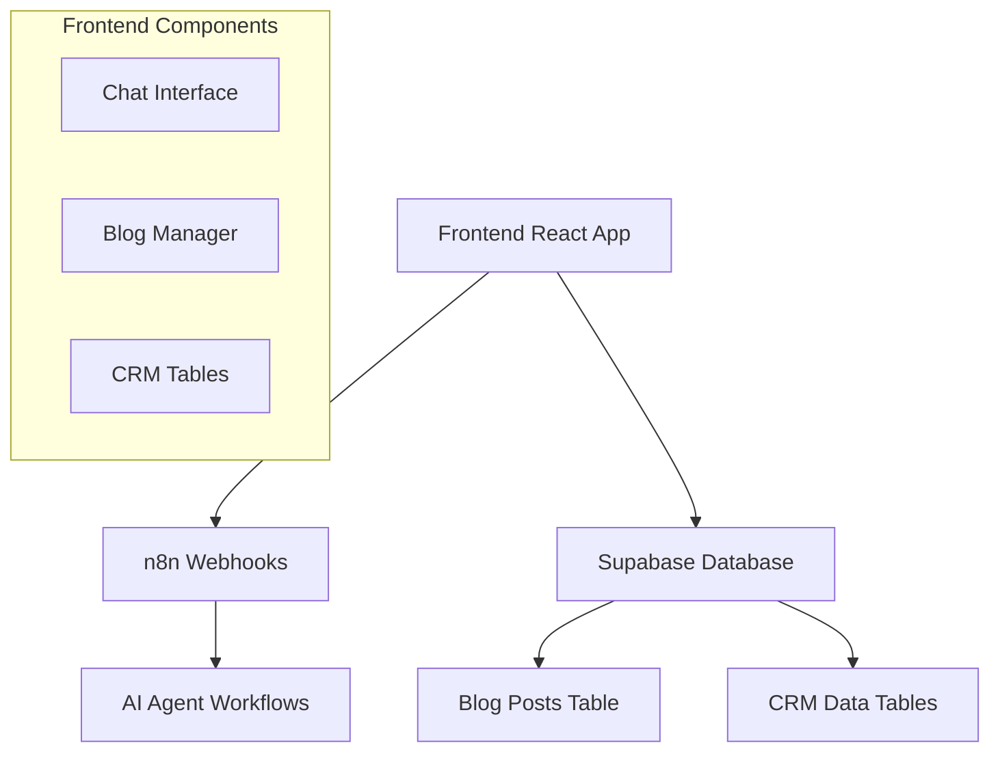

# Småbåthavner AI Agent Frontend 🤖

> **Kunde**: Småbåthavner  
> **Domene**: https://smabathavner.ailabben.no  
> **Basert på**: AI Labben Frontend Template

---

## 🤖 AI/Cursor Onboarding Prompt

> **Kopier denne prompten til Cursor/AI for rask prosjektforståelse**

Du er en erfaren fullstack-utvikler som skal arbeide med dette AI Agent Frontend Template prosjektet. 

**OPPGAVE**: Gjør deg kjent med hele prosjektet ved å:

1. **Analyser arkitekturen** - Dette er en React/TypeScript frontend som kobler sammen:
   - Chat-interface for AI-agenter via n8n webhooks
   - CRM/Blog management via Supabase database
   - Hybrid løsning for både enkle chat-oppgaver og komplekse databehandling

2. **Forstå filstrukturen** - Utforsk disse nøkkelfilene:
   - `src/App.tsx` - Hovednavigasjon og layout
   - `src/store/chatStore.ts` - State management med React Context
   - `src/components/Blog/BlogManager.tsx` - CRM-funksjonalitet
   - `src/utils/n8nApi.ts` - API-integrasjon med n8n
   - `src/utils/blogService.ts` - Supabase database service

3. **Identifiser integrasjonspunkter**:
   - n8n webhooks for AI-agent kommunikasjon
   - Supabase for CRM/blog data
   - TypeScript types for type safety
   - Tailwind CSS for styling

4. **Vurder tilpasningsmuligheter** for nye kunder:
   - Agent-konfigurasjon i chatStore.ts
   - Database schema tilpasninger
   - Branding og styling-endringer
   - Nye CRM-tabeller og komponenter

**RESULTAT**: Du skal kunne svare på spørsmål om arkitektur, implementere nye funksjoner, tilpasse for kunder, og feilsøke problemer. Fokuser på å forstå data-flyten mellom frontend, n8n og Supabase.

Les ARCHITECTURE.md for tekniske detaljer og SETUP.md for kunde-tilpasninger.

---

En moderne, fullstack frontend-løsning for AI-agenter med chat-interface og CRM-funksjonalitet. Bygget for å integrere med n8n workflows og Supabase database.

## 📋 Oversikt

Dette er et **template repository** som gir deg:

- **💬 ChatGPT-lignende interface** - For enkle AI-samtaler
- **📊 CRM/Blog Management** - For komplekse workflows og databehandling  
- **🔗 n8n Integration** - Kobler til dine AI-agent workflows
- **🗄️ Supabase Integration** - Database for CRM-data og blogginnlegg
- **🎨 Responsive Design** - Fungerer på alle enheter
- **⚡ Real-time Updates** - Live data-synkronisering

---

## 🏗️ Arkitektur



**Teknisk stack:**
- **Frontend**: React 18 + TypeScript + Tailwind CSS
- **State**: React Context API
- **Backend**: n8n (AI workflows) + Supabase (database)
- **Build**: Vite
- **Icons**: Lucide React

---

## 🚀 Rask Oppstart

### 1. Klon Template

```bash
git clone <dette-repo-url> kunde-navn-frontend
cd kunde-navn-frontend
```

### 2. Installer Avhengigheter

```bash
npm install
```

### 3. Konfigurer Miljøvariabler

Kopier eksempel-filen:
```bash
cp env.example .env.local
```

Rediger `.env.local`:
```env
# n8n Configuration
VITE_N8N_BASE_URL=https://smabathavner.n8n.ailabben.no

# Supabase Configuration  
VITE_SUPABASE_URL=https://xyz.supabase.co
VITE_SUPABASE_ANON_KEY=eyJhbGciOiJIUzI1NiIsInR5cCI6IkpXVCJ9...

# Development
VITE_DEV_MODE=false
```

**VIKTIG**: Se [DOMAIN_SETUP.md](DOMAIN_SETUP.md) for komplett setup-guide for Småbåthavner.

### 4. Start Utviklingsserver

```bash
npm run dev
```

Appen vil være tilgjengelig på `http://localhost:3000`

---

## ⚙️ Kunde-tilpasning

### 🎯 Obligatoriske Endringer

1. **Agent-konfigurasjon** (`src/store/chatStore.ts`):
```typescript
const agents: Agent[] = [
  {
    id: 'kunde-agent',
    name: 'Kunde Agent',
    description: 'Kundens spesifikke AI-agent',
    icon: '🎯',
    color: 'bg-blue-500',
    n8nEndpoint: 'kunde-webhook-id' // Fra n8n
  }
];
```

2. **Database Schema** - Tilpass til kundens behov:
   - Modifiser `blogginnlegg` tabellen
   - Legg til kunde-spesifikke tabeller
   - Oppdater types i `src/types/blog.ts`

3. **Branding**:
   - Oppdater farger i `tailwind.config.js`
   - Endre logo og tekster
   - Tilpass navigasjon i `src/App.tsx`

### 🔧 Valgfrie Tilpasninger

- **Nye CRM-tabeller**: Legg til i `src/components/` 
- **Ekstra agenter**: Utvid `agents` array
- **Custom styling**: Modifiser CSS-klasser
- **Nye workflows**: Koble til flere n8n endpoints

---

## 🗄️ Database Setup (Supabase)

### Obligatorisk Tabell: `blogginnlegg`

```sql
create table public.blogginnlegg (
  id uuid not null default gen_random_uuid (),
  slug text not null,
  tittel text not null,
  ingress text not null,
  innhold_md text not null,
  publisert boolean null default false,
  dato date not null,
  created_at timestamp with time zone null default now(),
  constraint blogginnlegg_pkey primary key (id),
  constraint blogginnlegg_slug_key unique (slug)
) tablespace pg_default;
```

### Valgfrie Tabeller (eksempler):

```sql
-- Leads/kontakter
create table public.leads (
  id uuid primary key default gen_random_uuid(),
  navn text not null,
  epost text not null,
  telefon text,
  status text default 'ny',
  created_at timestamptz default now()
);

-- Oppgaver
create table public.tasks (
  id uuid primary key default gen_random_uuid(),
  tittel text not null,
  beskrivelse text,
  status text default 'pending',
  prioritet text default 'medium',
  created_at timestamptz default now()
);
```

---

## 🔗 n8n Integration

### CORS-konfigurasjon

**KRITISK**: n8n må konfigureres for CORS:

```env
# I n8n miljøvariabler
N8N_CORS_ORIGIN=http://localhost:3000,https://smabathavner.ailabben.no
```

### Webhook Setup

1. **Opprett workflow** i n8n
2. **Legg til Webhook node**
3. **Konfigurer "Respond to Webhook"**:
   ```json
   {
     "message": "{{ $('AI Agent Node').first().json.output }}",
     "success": true
   }
   ```
4. **Kopier webhook ID** til `.env.local`

### Eksempel Workflow

```
Webhook → AI Agent (OpenAI/etc) → Respond to Webhook
```

**Response Headers** (i "Respond to Webhook"):
```
Content-Type: application/json
Access-Control-Allow-Origin: *
```

---

## 📁 Prosjektstruktur

```
src/
├── components/
│   ├── Blog/
│   │   ├── BlogManager.tsx      # Hovedkomponent for blog-administrasjon
│   │   ├── EditPostModal.tsx    # Modal for redigering av innlegg
│   │   └── SimpleBlogManager.tsx # Fallback hvis Supabase ikke er konfigurert
│   ├── Chat/
│   │   └── EnhancedChatArea.tsx # Chat med CRM-handlinger
│   ├── ChatArea.tsx             # Standard chat-område
│   ├── ChatInput.tsx            # Input-felt for meldinger
│   ├── ChatMessage.tsx          # Individuelle meldinger
│   ├── ConnectionStatus.tsx     # Status for n8n-tilkobling
│   └── Sidebar.tsx              # Venstre sidebar med agenter
├── store/
│   └── chatStore.ts             # State management (React Context)
├── types/
│   ├── index.ts                 # Chat-relaterte typer
│   └── blog.ts                  # Blog/CRM-relaterte typer  
├── utils/
│   ├── n8nApi.ts               # API-kommunikasjon med n8n
│   └── blogService.ts          # Supabase service for blog-data
├── App.tsx                      # Hovedapp med navigasjon
└── main.tsx                     # React entry point
```

---

## 🎨 UI/UX Funksjoner

### Chat Interface
- **Real-time meldinger** til n8n workflows
- **Typing indicators** og loading states
- **Persistent historikk** per agent
- **Connection status** indikator

### Blog/CRM Manager
- **Interaktive tabeller** med søk og filtrering
- **Inline redigering** av boolean-verdier
- **Modal-basert redigering** for komplekse felt
- **Markdown-støtte** for innhold
- **Paginering** og sortering

### Responsiv Design
- **Mobile-first** tilnærming
- **Sidebar** som kollapser på mobile
- **Modaler** som tilpasser seg skjermstørrelse
- **Touch-vennlige** kontroller

---

## 🔧 Avansert Konfigurasjon

### State Management

Bruker **React Context API** for stabilitet:

```typescript
// src/store/chatStore.ts
const ChatProvider: React.FC<{ children: ReactNode }> = ({ children }) => {
  const [state, setState] = useState<ChatState>({
    messages: [],
    activeAgentId: 'default-agent',
    isLoading: false,
    agents: agents,
  });
  // ... provider logic
};
```

### API Services

**n8n Service** (`src/utils/n8nApi.ts`):
```typescript
export const n8nApi = {
  sendMessage: async (webhookId: string, message: string): Promise<N8nWebhookResponse> => {
    // ... implementation
  }
};
```

**Supabase Service** (`src/utils/blogService.ts`):
```typescript
export const blogService = {
  getAll: async (page, pageSize, filters) => { /* ... */ },
  update: async (id, updates) => { /* ... */ },
  // ... CRUD operations
};
```

### TypeScript Types

**Chat Types** (`src/types/index.ts`):
```typescript
export interface Message {
  id: string;
  role: 'user' | 'assistant';
  content: string;
  timestamp: Date;
  agentId: string;
}

export interface Agent {
  id: string;
  name: string;
  description: string;
  icon: string;
  color: string;
  n8nEndpoint?: string;
}
```

**Blog Types** (`src/types/blog.ts`):
```typescript
export interface BlogPost {
  id: string;
  slug: string;
  tittel: string;
  ingress: string;
  innhold_md: string;
  publisert: boolean;
  dato: string;
  created_at: string;
}
```

---

## 🚨 Feilsøking

### Vanlige Problemer

#### 1. **Hvit skjerm**
- Sjekk konsollen for JavaScript-feil
- Kontroller at alle miljøvariabler er satt
- Restart utviklingsserveren: `npm run dev`

#### 2. **n8n Connection Issues**
```bash
# Sjekk CORS-konfigurasjon
curl -H "Origin: http://localhost:3000" \
     -H "Access-Control-Request-Method: POST" \
     -H "Access-Control-Request-Headers: Content-Type" \
     -X OPTIONS \
     https://your-n8n-domain/webhook-test/your-webhook-id
```

#### 3. **Supabase Connection Issues**
- Verifiser URL og anon key i `.env.local`
- Sjekk at tabeller eksisterer
- Kontroller RLS (Row Level Security) policies

#### 4. **TypeScript Errors**
```bash
# Sjekk TypeScript-konfigurasjon
npx tsc --noEmit
```

### Debug-tips

1. **Åpne Developer Tools** (F12)
2. **Sjekk Network-fanen** for API-kall
3. **Se Console** for feilmeldinger
4. **Inspiser State** med React DevTools

---

## 📦 Deployment

### Build for Produksjon

```bash
npm run build
```

### Miljøvariabler i Produksjon

Sørg for å sette disse i hosting-plattformen:
```env
VITE_N8N_BASE_URL=https://prod-n8n-domain.com
VITE_SUPABASE_URL=https://prod-project.supabase.co  
VITE_SUPABASE_ANON_KEY=prod-anon-key
```

### Hosting-alternativer

- **Vercel** (anbefalt for React)
- **Netlify** 
- **AWS S3 + CloudFront**
- **Azure Static Web Apps**

---

## 🔄 Vedlikehold og Oppdateringer

### Template Updates

For å få oppdateringer fra template:

```bash
# Legg til template som remote
git remote add template <template-repo-url>

# Hent oppdateringer  
git fetch template main

# Merge selektivt (vær forsiktig!)
git merge template/main --no-commit
```

### Versjonering

- **Major**: Store arkitektur-endringer
- **Minor**: Nye funksjoner
- **Patch**: Bugfixes og små forbedringer

---

## 📞 Support og Dokumentasjon

### For AI/Cursor

Dette prosjektet er designet for å være **AI-vennlig**:

- **Konsistent kode-struktur**
- **Omfattende TypeScript-types**
- **Tydelige kommentarer**
- **Modulær arkitektur**

### For Utviklere

**Viktige filer å forstå:**
1. `src/App.tsx` - Hovednavigasjon og layout
2. `src/store/chatStore.ts` - State management
3. `src/utils/n8nApi.ts` - API-integrasjon
4. `src/components/Blog/BlogManager.tsx` - CRM-funksjonalitet

### Ressurser

- **React Docs**: https://react.dev
- **TypeScript**: https://www.typescriptlang.org
- **Tailwind CSS**: https://tailwindcss.com
- **Supabase Docs**: https://supabase.com/docs
- **n8n Docs**: https://docs.n8n.io

---

## 🏷️ Template Versjon

**Versjon**: 1.0.0  
**Sist oppdatert**: 2024  
**Kompatibilitet**: React 18+, Node.js 18+

### Changelog

#### v1.0.0 (Current)
- ✅ Initial template release
- ✅ Chat interface med n8n integration
- ✅ Blog/CRM manager med Supabase
- ✅ Responsive design
- ✅ TypeScript support
- ✅ Interactive modal editing
- ✅ Real-time data syncing

---

## ⚙️ TODO / Fremtidige Funksjoner

### Innstillinger-knapp
**Status**: Midlertidig skjult  
**Plassering**: Nederst i venstre sidebar (kommentert ut i `src/components/Sidebar.tsx`)

**Planlagt funksjonalitet:**
- Brukerprofil-innstillinger
- Tema-tilpasning (utvidet)
- n8n webhook konfigurasjon
- Supabase tilkoblingsstatus
- Eksport/import av data
- Avanserte chat-innstillinger

**For å aktivere:**
1. Fjern kommentarer rundt Settings-knappen i `src/components/Sidebar.tsx`
2. Legg til Settings-import i import-statement
3. Implementer ønsket funksjonalitet i en ny Settings-komponent

### Andre planlagte funksjoner:
- [ ] React Query for advanced caching
- [ ] Websockets for real-time chat
- [ ] PWA support for offline functionality
- [ ] Internationalization (i18n) support

---

**🎯 Klar for å starte et nytt kundeprosjekt? Klon dette repoet og følg oppstart-guiden!**